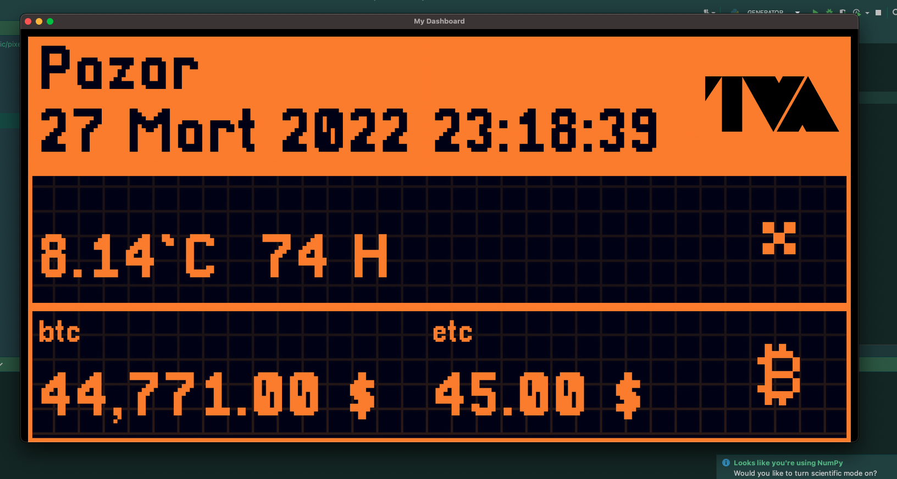

# my-screen-dashboard


## setup

Firstly, create a new api key https://openweathermap.org/appid and write config.json

```terminal
pip install -r requirements.txt
```

## run
```terminal
python main.py start 
python main.py start -t ocean
```


